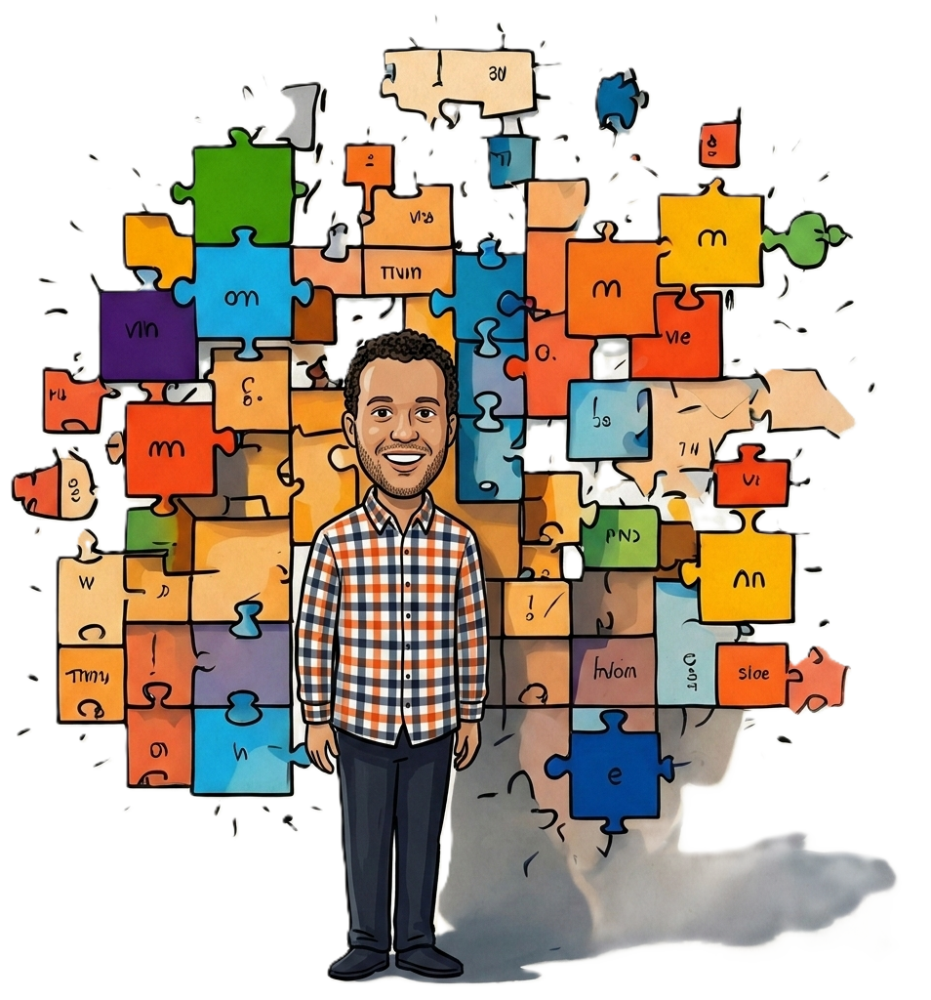

::: hero
::: hero-text

[PROFESSOR, SOCIAL SCIENTIST & RESEARCHER]{.subtitle}

::: social-icons
[](https://github.com/scjhamilton/)
[](https://www.linkedin.com/in/scott-hamilton-69b58453/)
[](mailto:scj.hamilton@gmail.com)
:::

This is a site of my thoughts on the way to becoming a better social data scientist. I will be posting my thoughts on the process, the tools I am using, and the projects I am working on.

:::

:::